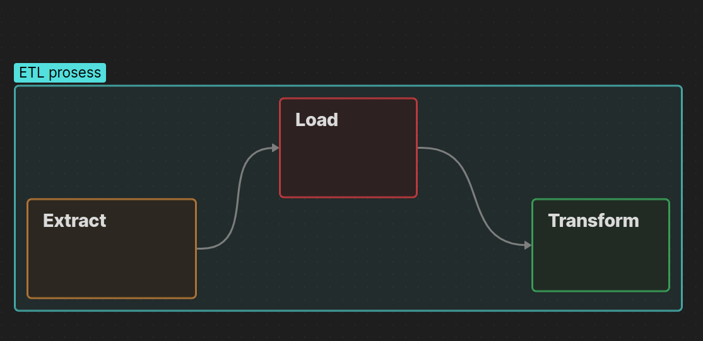

# simply_ETL Project Overview

This project is simple ETL pipeline for transform data from multiple source files (csv, json, xml) to one csv file.

## What is ETL?

ETL mean Extract, Transform and Load.  
- Extract: Get data from sources  
- Transform: Change data to needed form  
- Load: Save data to target file or database

## Data sources

We use three type files:  
- CSV (source1.csv, source2.csv, source3.csv)  
- JSON (source1.json, source2.json, source3.json)  
- XML (source.xml)

All files contain same data but different formats.

## ETL process schema

Below image shows ETL steps in pipeline:  

- First we extract data from all source files  
- Then transform heights and weights units  
- Finally load all data to `transformed_data.csv`

---

